# Microsoft Entra ID IAM Lab

A beginner-friendly, hands-on Identity and Access Management (IAM) project built in Microsoft Entra ID.

> **Note:** RG Tech Ltd is a fictional organisation created solely for lab and portfolio purposes. All users shown are fictional test identities.

## Project Overview

This project simulates a small workforce IAM environment for **RG Tech Ltd**. The aim was to practise core IAM tasks commonly performed by junior IAM / Identity Analysts, including identity provisioning, access control, MFA, Joiner-Mover-Leaver (JML) processes, access reviews, enterprise application assignment, SAML SSO, and audit validation.

## Technologies Used

- Microsoft Entra ID
- Microsoft Authenticator
- Microsoft Entra SAML Toolkit
- Azure / Entra administration portal

## IAM Concepts Demonstrated

- User provisioning and identity lifecycle management
- Security group management
- Role-Based Access Control (RBAC)
- Least privilege
- Multi-Factor Authentication (MFA)
- Joiner-Mover-Leaver (JML)
- Access review and access removal
- Enterprise application assignment
- SAML 2.0 Single Sign-On (SSO)
- Audit logs and sign-in monitoring

---

## 1. Workforce Identity Provisioning

Created a small fictional workforce across HR, Finance, and IT departments. Each identity was given job and department information to simulate a basic enterprise directory.

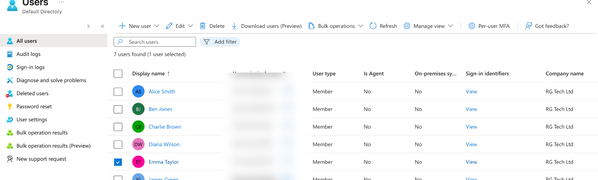

---

## 2. Department-Based Security Groups

Created assigned security groups to organise users by business function:

- `SG-HR-Users`
- `SG-Finance-Users`
- `SG-IT-Users`
- `SG-IT-Support`

This demonstrates group-based access administration rather than assigning access independently to every user.

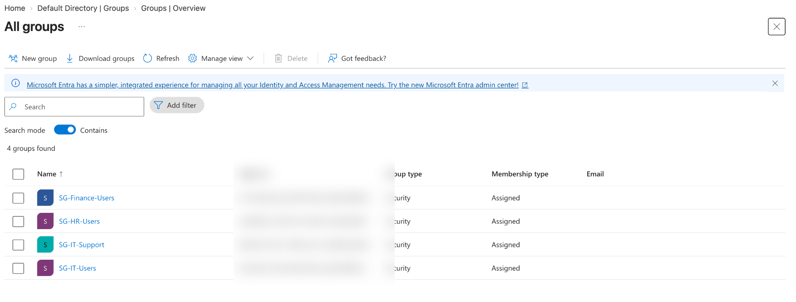

---

## 3. Least Privilege and Administrative Roles

Assigned **Emma Taylor**, the fictional IT Support Analyst, the built-in **Helpdesk Administrator** role instead of Global Administrator.

This demonstrates the principle of **least privilege** by limiting privileged access to what is required for the support role.

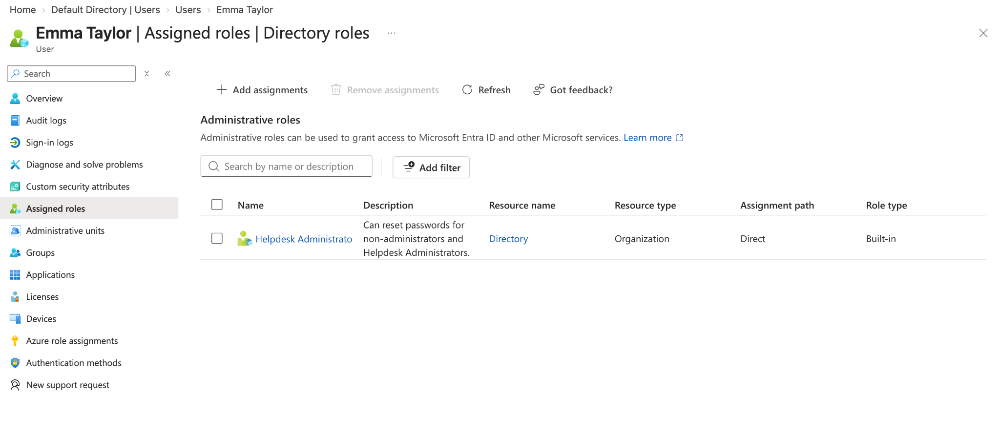

---

## 4. Multi-Factor Authentication

Registered Microsoft Authenticator for the IT Support identity and validated MFA as an authentication method.

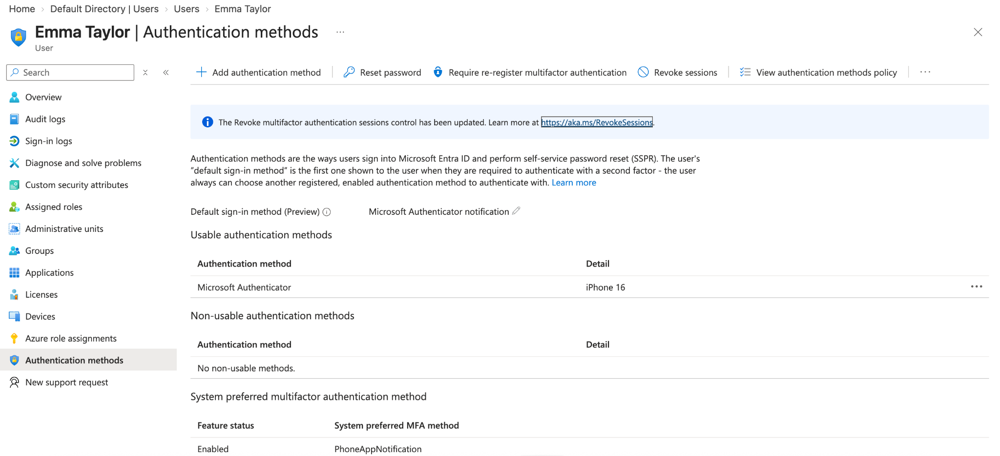

---

## 5. Joiner-Mover-Leaver Lifecycle

Used **Sarah Parker** as a lifecycle test identity.

### Joiner
- Created the user account.
- Added the user to the appropriate department security group.

### Mover
- Updated job and department information.
- Removed previous department access.
- Added access appropriate to the new role.

### Leaver
- Removed group access.
- Disabled the account.
- Revoked sessions as part of offboarding.

The Entra audit trail records the lifecycle activity.

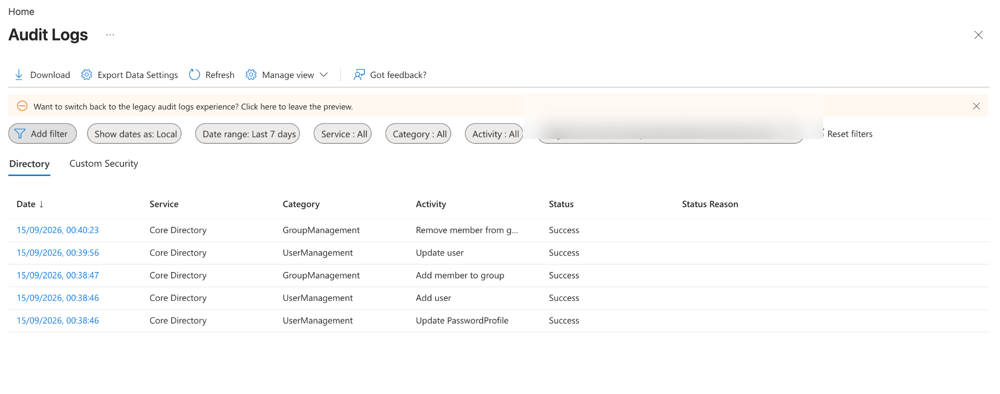

---

## 6. Access Review and Least-Privilege Remediation

Created `SG-IT-Support` and reviewed membership.

During the simulated review:
- **Emma Taylor** retained access because it matched her IT Support role.
- **James Green** was removed because elevated support access was no longer required.

This demonstrates an access review followed by remediation of unnecessary access.

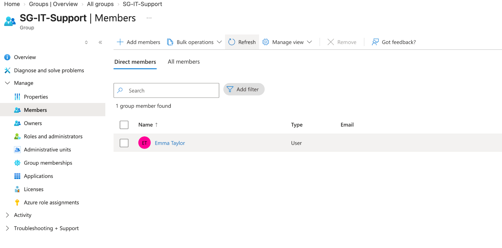

---

## 7. Enterprise Application Assignment

Added the **Microsoft Entra SAML Toolkit** as an Enterprise Application and assigned Emma Taylor as an authorised user.

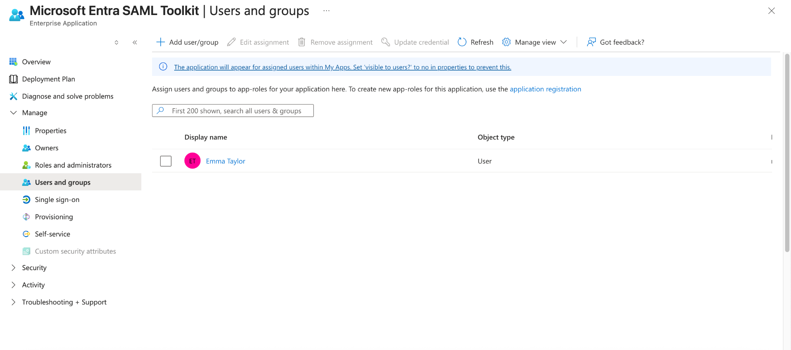

---

## 8. SAML 2.0 Single Sign-On

Configured SAML-based SSO between Microsoft Entra ID and the Microsoft Entra SAML Toolkit.

The test user successfully authenticated through Entra ID into the application using SSO.

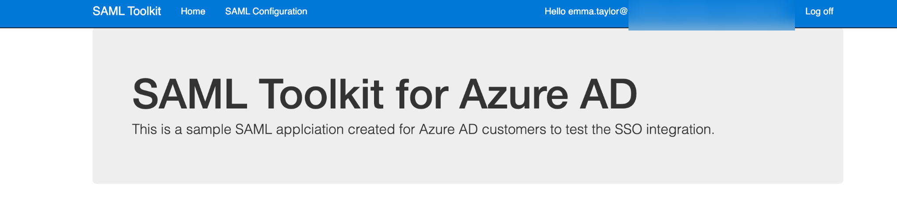

---

## 9. Sign-In Monitoring

Reviewed Entra sign-in logs to confirm successful authentication events for the SAML application.

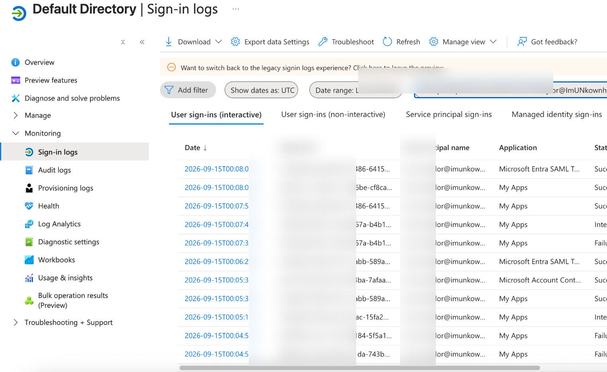

---

## 10. Leaver Account Disablement

Verified that the leaver identity was disabled after access removal.

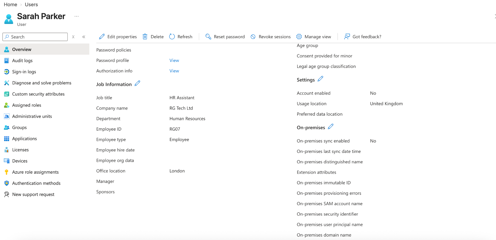

---

## 11. IAM Access Control Matrix

Created an access-control matrix to document expected access by user and role.

The matrix records:
- Department security-group membership
- IT support access
- Privileged Helpdesk Administrator access
- SAML application access
- Account status

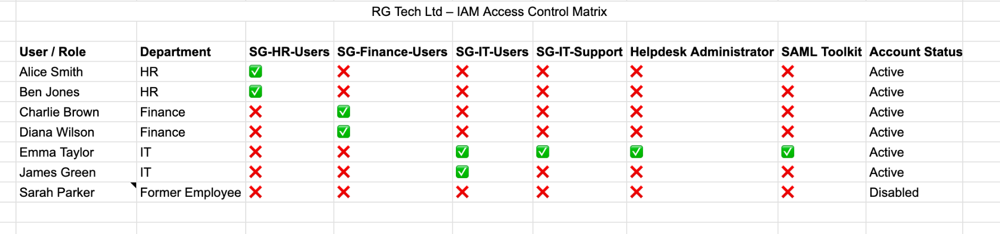

---

## What I Learned

This project helped me understand how identity controls work together in a practical IAM environment rather than as isolated concepts. In particular, I gained hands-on experience with:

- Managing users and security groups in Microsoft Entra ID
- Applying least privilege to privileged administrative roles
- Registering and validating MFA
- Managing identity changes through Joiner-Mover-Leaver workflows
- Reviewing and removing unnecessary access
- Assigning users to Enterprise Applications
- Configuring and testing SAML 2.0 SSO
- Using audit and sign-in logs to validate IAM activity

## Future Improvements

Possible next steps for this lab include:

- Conditional Access policies
- Automated or dynamic group membership
- Formal Entra Access Reviews / Identity Governance
- Privileged Identity Management (PIM)
- Application provisioning / SCIM
- Hybrid Active Directory and Entra ID integration

Some of these features require Microsoft Entra ID P1/P2 licensing.

---

## Disclaimer

This is a **simulated IAM portfolio project** and does not represent production administration for a real organisation. RG Tech Ltd and all employee identities in this repository are fictional.
